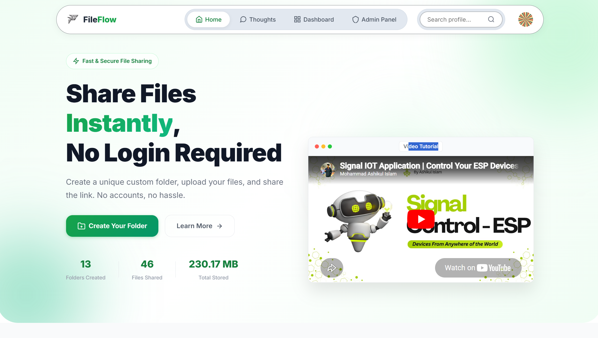
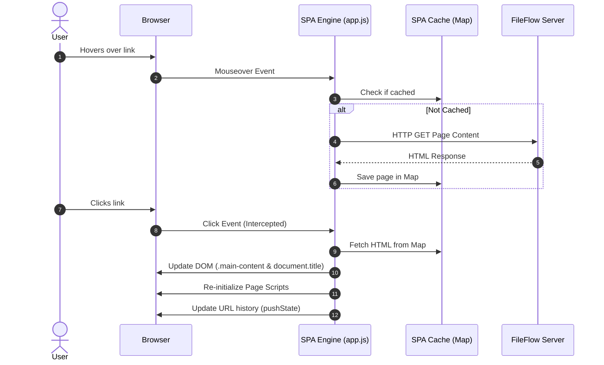

<div align="center">
  

  <br />

  <h1>🚀 FileFlow</h1>
  <p><strong>A High-Performance, Secure File Sharing &amp; Social Ecosystem</strong></p>

  <p>
    <a href="#-overview">Overview</a> •
    <a href="#-key-highlights">Highlights</a> •
    <a href="#-system-architecture">Architecture</a> •
    <a href="#-core-features">Features</a> •
    <a href="#-tech-stack">Tech Stack</a> •
    <a href="#-installation--setup">Setup</a> •
    <a href="#-developer--credits">Developer</a>
  </p>

  <p>
    
    
    
    
    
  </p>
</div>

---

## 🌟 Overview

**FileFlow** is a modern, high-speed file-sharing platform designed for both simplicity and power. It allows users to create custom-named "Flow Folders" to share files instantly via professional, unique URLs. 

Unlike traditional file-sharing websites, FileFlow is also a **micro-social ecosystem**. Registered users can build professional profiles (Digital Profile Cards), connect with other members, chat in real-time with typing indicators, and share their updates and files via a global "Thoughts" feed.

Built with a focus on **User Experience (UX)** and **Lightning Speed**, FileFlow bridges the gap between traditional PHP applications and modern SPAs (Single Page Applications) through a custom-built, client-side caching navigation engine.

---

## ⚡ Key Highlights

### 🚄 Next.js Style SPA Engine
FileFlow features a custom-built, client-side Single Page Application (SPA) routing engine that eliminates full browser reloads:
* **Zero-Reload Page Swaps:** Clicked internal links dynamically load target content and update history states.
* **Hover-Prefetching:** Pages are pre-fetched in the background as you hover over links, making transitions feel instantaneous.
* **Global Progress Bar:** A sleek green loader provides immediate visual feedback for all navigation actions.
* **Continuous Uploads:** Since navigation is handled via AJAX/DOM-replacement, files continue uploading seamlessly in the background while users explore the site.

### 🛡️ Enterprise-Grade Security
Security is baked into every layer of the application:
* **Upload Firewall:** Strict validation of MIME-types using PHP `finfo` against a verified whitelist, combined with defensive regex to block double extensions and dangerous script execution (e.g. `.php`, `.exe`, `.bat`).
* **Protected Directories:** Multi-tier access prevention including `.htaccess` directives prohibiting direct indexing or file execution inside upload folders, supplemented by fallback empty `index.html` indexes.
* **State Protection:** Native CSRF tokens validated on all state-changing API endpoints (`POST`, `PUT`, `DELETE`).
* **Credential Hashing:** Industry-standard password hashing using BCrypt with a cost factor of 12.

### ⚙️ High-Performance Caching & raw TCP Fallback
To ensure low Time to First Byte (TTFB), FileFlow leverages Redis:
* **Granular Caching:** Caches folder records, directory trees, statistics, and user profile information.
* **Smart Invalidation:** Cache entries are targeted and flushed only when related mutations occur (e.g., adding files, modifying profiles).
* **RESP Protocol Socket Fallback:** If the `php-redis` extension is missing on the server, FileFlow automatically switches to `SocketRedis`—a custom wrapper that communicates directly with Redis via raw TCP sockets using standard Redis Serialization Protocol (RESP).

---

## 🏗️ System Architecture

### 1. Request Routing Flow
FileFlow uses Apache's `mod_rewrite` to channel clean URLs through a single-entry-point router script. Static assets are bypassed automatically to ensure high-performance browser retrieval.

```mermaid
graph TD
    A[Client Request] --> B{Apache Rewrite Engine}
    B -->|Static Asset /assets/* [L]| C[Serve Static Asset]
    B -->|All Other Requests [Rewrite]| D[index.php Router]
    D --> E{Router Switch}
    E -->|Auth/Dashboard/Static Pages| F[Load PHP Templates in /pages]
    E -->|API Endpoints /api/*| G[Process API in /api]
    E -->|User Profile Card /u/*| H[Serve pages/profile-card.php]
    E -->|Single Thought /p/*| I[Serve pages/single-thought.php]
    E -->|Default Catch-All Slug| J{Validate Slug in DB}
    J -->|Found| K[Serve pages/folder.php]
    J -->|Not Found| L[Serve pages/error.php]
```

### 2. Client-Side SPA & Prefetch Lifecycle
The Javascript engine (`app.js`) intercepts default link clicking events, loading pages asynchronously and pre-fetching links on hover to provide a premium SPA-like experience.



### 3. Repository Directory Structure
```
FileFlow/
├── api/                       # API endpoints (Auth, folders, uploads, messages, thoughts)
│   ├── admin-*.php            # Administrative API controllers
│   ├── auth-*.php             # Authentication controllers
│   └── *.php                  # Feature controllers (upload, download, thoughts, connection)
├── assets/                    # Static UI resources
│   ├── css/
│   │   ├── base.css           # Core browser resets and CSS variables
│   │   └── style.css          # Main UI components, grids, and themes
│   ├── js/
│   │   └── app.js             # SPA engine, upload manager, UI utilities
│   └── img/                   # Graphics assets
├── config/                    # Configuration settings
│   ├── config.php             # General settings (sizes, extensions, constraints)
│   └── database.php           # DB credentials (MySQL and Redis)
├── includes/                  # Core helpers, helpers, components
│   ├── auth.php               # Login/Registration validation libraries
│   ├── footer.php             # Shared layout footer
│   ├── functions.php          # Database helper utilities and security validations
│   ├── header.php             # HTML head, layouts, and SPA progress bar
│   ├── redis.php              # Redis instance wrapper & raw TCP socket implementation
│   └── thought_component.php  # UI component helper for thoughts feed rendering
├── pages/                     # Frontend views
│   ├── admin.php              # Command Center dashboard for admin
│   ├── dashboard.php          # Logged-in user stats and history dashboard
│   ├── error.php              # Error layout handler
│   ├── folder.php             # Flow Folder view (file download / upload area)
│   ├── home.php               # Land page layout (Folder creation input)
│   ├── messages.php           # User connection chats and inbox page
│   ├── profile-card.php       # Public User Profile page (/u/[slug])
│   ├── profile.php            # Profile Card editing page
│   ├── thoughts.php           # Public social Feed and Microblog page
│   └── *.php                  # Auth forms templates (login, register, reset-password)
├── user_documents/            # Physical folder uploads (auto-generated, protected)
├── .htaccess                  # Apache server rewrites and upload optimizations
├── database.sql               # Default raw database database structure
├── index.php                  # Application entry point and router switch
└── setup_db.php               # Dynamic DB upgrade script and Admin setup
```

---

## ✨ Core Features

### 📂 Flow Folders (Dynamic Sharing)
* **Custom Names:** Claim custom slugs (e.g. `/my-shared-files`) for unique, professional presentation.
* **Security Settings:** Toggle password protection on folders. Passwords are encrypted on the database using salted BCrypt.
* **Auto-Expiration:** Set folders to expire after 1 hour, 24 hours, 7 days, 30 days, or never. Expired folders and their physical files are automatically deleted via the cleanup scheduler.
* **Visits Analytics:** Visually track how many views a folder has received.
* **QR Codes:** Instantly auto-generate QR codes for folders so mobile users can scan and access files quickly.

### 📤 Resilient Chunked Uploads
* **Queue Management:** Supports multi-file selection (up to 10 files per batch) and handles uploads in an asynchronous queue (up to 5 concurrent streams).
* **Chunking Protocol:** Splits large files into small 2MB packets. This prevents server timeout errors, bypasses small PHP upload configuration limits, and allows for clean auto-resuming on network hitches.
* **Persistent Upload Widget:** A floating control panel displaying speed (KB/s), progress percentage, active file queues, and time-remaining (ETA) calculations. Users can minimize it and browse the website while uploads continue uninterrupted.

### 💬 Social & Networking Engine
* **Connections:** Search for users and send, accept, or reject networking connection requests.
* **Direct Messaging:** Live chat interface complete with unread badge alerts, historical logs, message deletion, and live typing indicators.
* **Public/Private Feed:** Share posts with text content, link references, or attached file media. Options to set visibility to Public, Connections-only, or Private.
* **Interactions:** Support for liking posts, nested comment replies (hierarchical threads), and sharing tracking.

### 👤 Interactive Digital Profile Cards
* Accessible via `/u/[username]`, these responsive card systems showcase professional branding.
* Supports customized header background covers, user profile avatars, career bio, and work experience notes.
* Integrated digital CV download options with custom button colors.
* Direct connection actions (Connect, Message) and profile view counter.

### 👑 Admin Command Center
* Comprehensive overview of system-wide metrics (total folders, user files, storage size, and active networks).
* User management panel to change storage limit allocations, reset credentials, or lock accounts.
* Bulk cleaning operations (bulk purging folders, registered users, and profile cards).
* Global maintenance mode toggle with custom page redirection.

---

## 💻 Tech Stack

* **Backend:** Native PHP 8.1+ (Object-Oriented Database Models, Clean Switch Router)
* **Frontend:** Vanilla JS (ES6+), Vanilla CSS (Custom Variable Tokens Design System), HTML5
* **Caching Engine:** Redis (Standalone daemon or Raw Socket RESP Client)
* **Database:** MySQL 8.0+ / MariaDB (PDO Prepared Statements, optimized foreign-key cascades)
* **Web Server Configuration:** Apache 2.4 (mod_rewrite, mod_deflate, mod_expires, mod_headers)

---

## 🚀 Installation & Setup

Follow these steps to set up FileFlow in your local development environment or hosting server.

### Prerequisites
* PHP 8.1 or higher
* MySQL 5.7+ or MariaDB 10.3+
* Redis Server (Optional)
* Apache Web Server with `mod_rewrite` enabled

### 1. Clone the Repository
Clone the codebase to your web server document root (e.g., `htdocs` or `/var/www/html`):
```bash
git clone https://github.com/hey-ashik/FileFlow.git
cd FileFlow
```

### 2. Configure Virtual Host (Important for clean URLs)
Make sure your Apache Virtual Host points to the root of the project folder and has `AllowOverride All` configured to let the `.htaccess` override directory rules.

Example Apache config:
```apache
<VirtualHost *:80>
    ServerName fileflow.local
    DocumentRoot "C:/path/to/FileFlow"
    
    <Directory "C:/path/to/FileFlow">
        Options Indexes FollowSymLinks
        AllowOverride All
        Require all granted
    </Directory>
</VirtualHost>
```

### 3. Setup the Database
Create a new MySQL database named `ashikone_fileflowdb`.
```sql
CREATE DATABASE `ashikone_fileflowdb` CHARACTER SET utf8mb4 COLLATE utf8mb4_unicode_ci;
```

### 4. Configuration Setup
Update your configuration settings inside `config/database.php` and `config/config.php`.

* Open `config/database.php` and fill in your database credentials:
```php
define('DB_HOST', 'localhost');
define('DB_NAME', 'ashikone_fileflowdb');
define('DB_USER', 'your_mysql_username');
define('DB_PASS', 'your_mysql_password');

// If using Redis, configure below. Otherwise, set REDIS_ENABLED to false.
define('REDIS_HOST', '127.0.0.1');
define('REDIS_PORT', 6379);
define('REDIS_PASS', '');
define('REDIS_ENABLED', true);
```

* Open `config/config.php` and set your application URL:
```php
define('APP_URL', 'http://fileflow.local'); // or your server IP/domain
```

### 5. Run Database Setup Tool
Access the database setup tool via browser or command line. This creates the schema structure, configures indices, and sets up your default Admin user.

* **Via Browser:** Navigate to `http://fileflow.local/setup_db.php`
* **Via CLI:** Run `php setup_db.php` in the terminal.

#### Default Admin Credentials (Auto-created during setup)
* **Email:** `ashikulislam2070@gmail.com`
* **Password:** `Ashik@21032001`
* **Role:** Administrator (Permissions to view admin panel and adjust platform settings)

### 6. Verify Permissions
Ensure the upload directory is writable:
* Create the `user_documents` directory in the root if not present.
* On Linux/macOS, run:
  ```bash
  chmod -R 775 user_documents
  chown -R www-data:www-data user_documents
  ```

---

## 👨‍💻 Developer & Credits

Designed and developed with passion and precision by **Ashikul Islam**.

| Channel | Contact / Link |
| :--- | :--- |
| 💬 **WhatsApp** | [+8801792250709](https://wa.me/8801792250709) |
| 🌐 **Portfolio** | [ashikone.com](https://ashikone.com) |
| 🐙 **GitHub Profile** | [@hey-ashik](https://github.com/hey-ashik) |

---

<div align="center">
  <sub>&copy; 2026 FileFlow Platform. Engineered for speed, designed for security.</sub>
</div>
